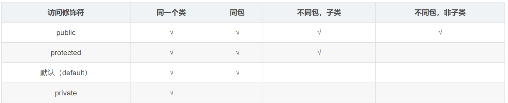

# JAVA基础

## static

可以分为static方法与static变量，static方法不能访问非static变量

static方法可以应用于工具类 xxxUtil，如下

```java
package com.marxicb.advancedclass.a01staticdemo1;

import java.util.ArrayList;

public class StudentUtil {
    private StudentUtil(){};
    public static int getMaxAgeStudent(ArrayList<Student> list){
        int maxAge = 0;
        for(int i=0;i< list.size();i++){
            if(maxAge<list.get(i).getAge()){
                maxAge=list.get(i).getAge();
            }
        }
        return maxAge;
    }
}

```

构造方法设置为private

## 继承

```java
public class Zi extends Fu{}
```

java中只能单继承

继承时的内容

构造方法：不继承，需要在子类构造方法里super调用

成员变量：继承，但是涉及到权限问题

成员方法：继承虚方法，替换虚方法表里的方法

虚方法指非private 非static 非final修饰的方法

------

### 变量访问规则

默认状态下：

局部变量-本地成员-父类成员

this.name 从本地开始

super.name 从父类开始

------

### 重写

对父类中的方法进行重写，本质上就是修改虚方法表

1.重写方法的名称、形参列表必须与父类中的一致

2.子类重写父类时，访问权限子类必须大于等于父类

3.返回值类型必须小于等于父类

------

### 构造方法

子类构造时默认先执行父类的无参构造

如需手动super指定则必须放在第一行

------

### 多态

```
Fu fuName= ziName; 
```

在继承下，存在方法重写，当使用父类类型对象进行访问时展现出不同的形态。

本质原理是调用函数时访问虚方法表，此时寻找到的同名函数已被子类替换，因此若访问变量则还是父类的，因为其不存在虚方法，都被继承了。

------

### final

表明方法不可被重写

表明类不可被继承

表明常量只能被肤质一次

## 包

1.使用同一个包中的类时不需要导包

2.java.lang包不需要导

3.其他情况需要导包

4.如果同时使用两个包里的同名类，需要全类名

```java
import package.class
import package.*
//*只会导入包下的方法，不会导入子包的方法
```

一种特殊import

static import

```java
package com.assignment.test;

public class staticFieldsClass {
	static int staticNoPublicField = 0; 
	public static int staticField = 1;
    public static void staticFunction(){}
}
```

```java
//**精准导入**
//直接导入具体的静态变量、常量、方法方法，注意导入方法直接写方法名不需要括号。
import static com.assignment.test.StaticFieldsClass.staticField;
import static com.assignment.test.StaticFieldsClass.staticFunction;

//或者使用如下形式：
//**按需导入**不必逐一指出静态成员名称的导入方式
//import static com.assignment.test.StaticFieldsClass.*;

public class StaticTest {
    public static void main(String[] args) {
	    //这里直接写静态成员而不需要通过类名调用
        System.out.println(staticField);
        staticFunction();
    }
}
```

## 代码权限符和代码块




局部代码块

```JAVA
public class Test{
	public static void main(String[] args){
		{
			int a=10;
			System.out.println(a)
		}
	}
}
```

构造代码块、静态代码块

```java
public class Student{
	private String name;
	private int age;
	//构造代码块
	//写在成员位置的代码块
	//创建对象时先执行构造代码块再执行构造方法
	{
		System.out.println("1");
	}
	//静态代码块
	//随着类的加载而加载
	static{
		System.out.println("0");
	}
	public Student(){}
	public Student(String name,int age){
		this.name=name;
		this.age=age;
	}
}
```

## 抽象类抽象方法

1.作用

抽象共性时，无法确定方法体，就把方法定义为抽象的。

强制让子类按照某种格式重写。

抽象方法所在的类，必须是抽象类。

2.格式

```java
public abstract 返回值类型 方法名(参数列表);
public abstract class name{}
```

3.继承时

要不重写所有抽象方法

要么是抽象类

## 接口的定义和使用

接口用关键字interface来定义

```java
public interface 接口名{}
```

接口不能实例化

接口和类之间是是实现关系，通过implements关键字表示

```java
public class 类名 extends 父类 implements 接口1,借口2{}
```

接口的子类要么实现接口中的所有抽象方法要么是抽象类

成员变量：

​	只能是常量

​	默认修饰符：public static final

构造方法：

​	无

成员方法：

​	只能是抽象方法

​	默认修饰符：public abstract

接口可以继承多个接口

```java
public interface Inter3 extends Inter2,Inter3{}
```

后续版本更新特点：

JDK8

JDK8以后接口新增默认方法

允许在接口中定义默认方法，default

```java
public default void show(){}
```

注意事项：

​	默认方法不是抽象方法可以不限制重写，但是如果被重写，重写的时候要去掉defualt

​	public可以被省略

​	如果多个接口出现重名的默认方法，则此时必须要重写

允许在接口中定义静态方法，static

```java
public static void show(){}
```

注意事项：

​	静态方法只能通过接口名调用，不能通过类名和对象名

​	public可以省略

JDK9

允许接口定义私有方法

```
private void show()
private static void show()
```

## 适配器设计模式

当一个接口中抽象方法过多，但是只使用其中一部分的时候

编写中间类XXXAdapter空实现对应的接口，让需要的类继承该中间类


## 内部类

典型：ArrayList的迭代器

### 成员内部类

写在变量位置

可以像一般变量一样被修饰符修饰

JDK16以前内部类里不能定义静态变量

获取方式：

1.在外部类中编写方法，对外提供内部类的对象。

2.直接创建：外部类名.内部类名 对象名=外部类对象.内部类对象。

```java
Outer.Inner oi= new Outer().new Inner();
```

```java
package com.marxicb.advancedclass.a02innerclassdemo;

public class Outer {
    private int a=10;
    class Inner{
        private int a=20;
        public void show(){
            int a=30;
            System.out.println(Outer.this.a);//10
            System.out.println(this.a);//20
            System.out.println(a);//30
        }
    }
}
```

在Inner的对象内存模型中，存在一个Outer this指针指向其外部类对象

### 静态内部类

静态内部类只能访问外部类中的静态变量和静态方法，如果想要访问非静态的需要创建对象

```java
package com.marxicb.advancedclass.a02innerclassdemo;

public class Car {
    String carName;
    static class Engine{
        String engineName;
    }
}
```

创建静态内部类对象：外部类名.内部类名 对象名 = new 外部类名.内部类名();

调用非静态方法的格式：先创建对象，用对象调用

调用静态方法的格式：外部类名.内部类名.方法名();

### 局部内部类

1.类被在方法内定义

2.性质等同于局部变量，无法被外界选用，也同样可以访问类中变量

### 匿名内部类

```java
new 类名或及接口名(){
	重写方法;
};
```

```java
public interface Swim{
	public abstract void swim();
}
------
public class Test{
	public static void main(){
		Swim s = new Swim(){
			@Override
			public void swim(){
				System.out.println("重写后的方法");
			}
		}
	}
}
```

## Object

Object 是java中的顶级父类，所有类都直接或间接继承于Object

Object有11个成员方法，以下记录其中几个

public String toString() 返回对象的字符串表示形式

public boolean equals(Object obj) 比较两个对象是否相等

protected Object clone(int a) 对象克隆

## Arrays

操作数组的工具类

toString、binarySearch、copyOf、copyOfRange、fill、sort

```java
Arrays.sort(arr, new Comparator<Integer>(){
	@Override
	public int compare(Integer o1,Integer o2){
		return o1-o1;
	}
})
```

## Lambda

替代上述

```java
Arrays.sort(arr,(Integer o1,Interger o2)->{
	return o1-o2;
})
```

就是对接口的匿名内部类的简化

要求该接口中只有一个抽象方法